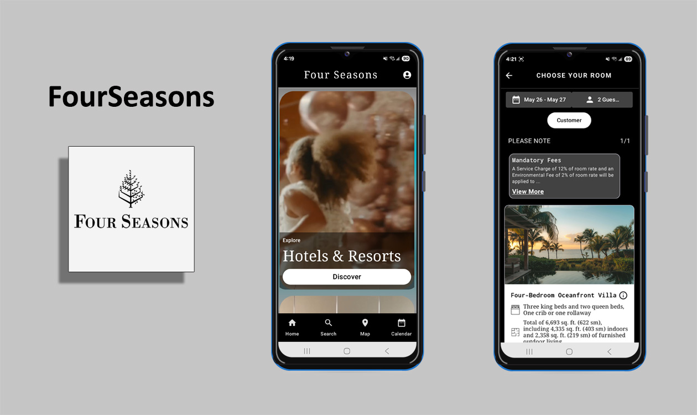
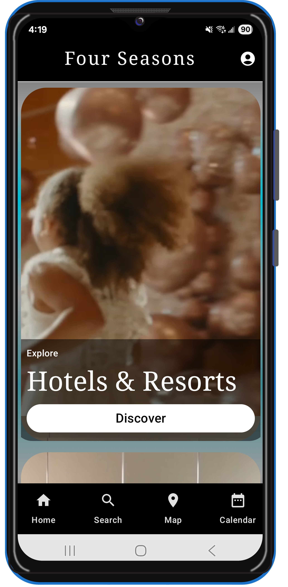
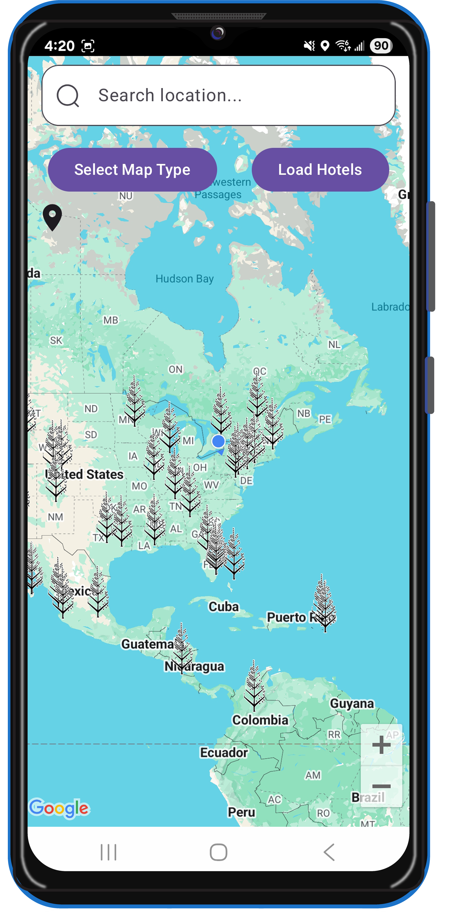
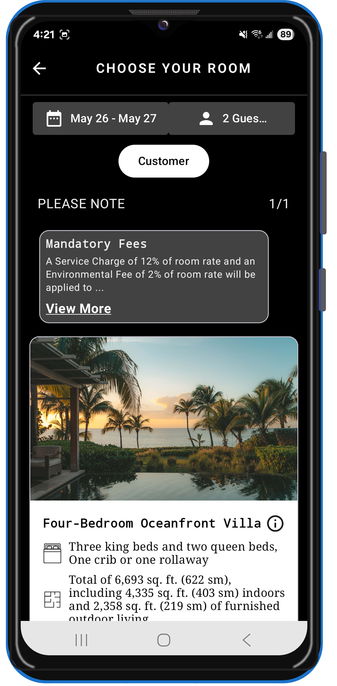
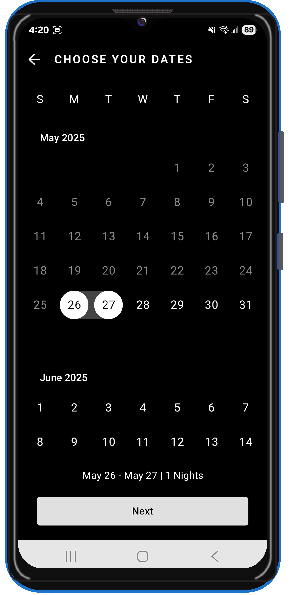
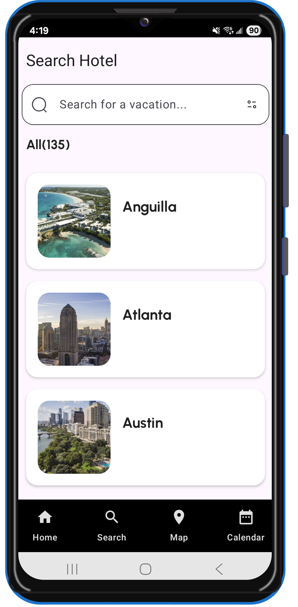
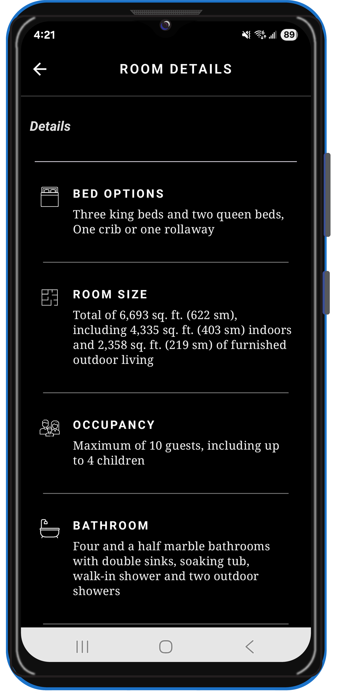
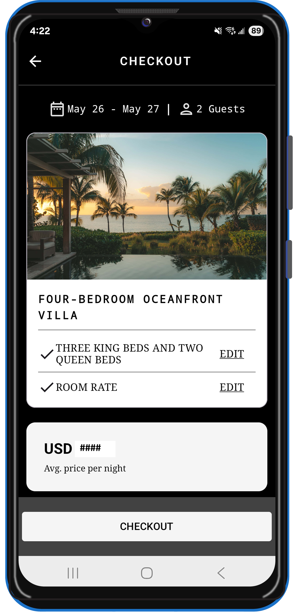

<div style="text-align: center;">
    <h1>FourSeasons - Jetpack Compose</h1>
</div>

<div align="center">
    
    <p><em>Your premium hotel booking companion built with Jetpack Compose</em></p>
    <!-- Optional: Uncomment and update the link when live on Play Store -->
    <!-- <a href="https://play.google.com/store/apps/details?id=com.yourcompany.flyaway">
        
    </a> -->
</div>

---

## 📖 Overview

FourSeasons Hotel Booking App is a portfolio demo showcasing, feature-rich Android application designed to simplify the hotel booking experience. Leveraging modern Android development with Jetpack Compose, FourSeasons App provides real-time location-based suggestions, seamless booking flows, and a rich media showcase for properties worldwide.

**Key Selling Points:**

* **Live Location & Distance Calculation:** Use Haversine formula to show hotels near you sorted by proximity.
* **Interactive Map View:** Explore hotels on a Google Map with Compose integration.
* **Intuitive Booking Calendar:** Select check-in and check-out dates via a sleek calendar component.
* **Rich Media Previews:** View high-resolution images and property videos with ExoPlayer.
* **In-App Chat Support:** Reach out to customer service using Sunshine Conversations SDK.
* **Offline Caching:** Persist recent searches and bookings with Room for offline access.

---

## 🎨 App Showcase

Below are placeholder images demonstrating FourSeasons’s core screens. Replace with actual screenshots in `/screenshots/`.

| Home & Search                                                               | Map & Distance                                                                | Hotel Details                                                                 | Booking Calendar                                                                    |
| --------------------------------------------------------------------------- | ----------------------------------------------------------------------------- | ----------------------------------------------------------------------------- | ----------------------------------------------------------------------------------- |
|  |  |  |  |

| Home List                                                                   | Gallery Screen                                                                | Room Details                                                                 | Checkout Screen                                                                     |
| --------------------------------------------------------------------------- | ----------------------------------------------------------------------------- | ----------------------------------------------------------------------------- | ----------------------------------------------------------------------------------- |
|        | |    |  |

**Screen Descriptions:**

* **Home & Search:** Browse destinations, filter by price/rating, and view quick results as you type.
* **Map & Distance:** Visualize hotel locations and their distance from your current position.
* **Hotel Details:** Access photo gallery, amenities list, reviews, and embedded property website via WebView.
* **Booking Calendar:** Choose check-in/out dates with a modern calendar widget; availability highlights show free slots.
* **Home List:** Discover luxury hotel listings with location, price, and rating previews in a clean scrollable list format.
* **Gallery Screen:** Swipe through high-resolution hotel images and explore ambiance, amenities, and room types.
* **Room Details:** Dive into detailed room specifications including pricing, room size, occupancy, and upgrade options.
* **Checkout Screen:** Simulate the booking process from room selection to final confirmation.

---

## 🛠️ Tech & Architecture

* **Language:** Kotlin
* **UI Toolkit:** Jetpack Compose
* **Architecture Pattern:** MVVM with Clean Architecture
* **Dependency Injection:** Hilt
* **Networking:** Retrofit + OkHttp + Gson Converter
* **Location Services:** Google Play Services Location
* **Local Data:** Room (Entities, DAOs)
* **Concurrency:** Kotlin Coroutines & Flow
* **Image & Video:** Coil for images, ExoPlayer (Media3) for video playback
* **Maps:** Maps Compose + Accompanist permissions
* **Calendar:** Kizitonwose Calendar (View & Compose)
* **Chat SDK:** Sunshine Conversations (Smooch)
* **Web Content:** AndroidX Webkit WebView
* **Testing:** JUnit, Espresso, Hilt Android Testing, Appium & Selenium for UI automation
* **CI/CD:** GitHub Actions (optional)

**Module Structure:**

```
|-- app             # Android application module
|-- animatednavbar  # Custom navigation component (as a gradle project)
|-- core            # Shared utilities, models, and helpers
|-- data            # Repositories, data sources (remote & local)
|   |-- remote      # Retrofit services
|   |-- local       # Room entities & DAOs
|-- domain          # Business logic & use-cases
|-- presentation    # Compose UI screens & ViewModels
```

---

## 🌐 Portfolio Showcase

FourSeasons App is featured here as a portfolio project, demonstrating advanced Android development skills and polished UI/UX. Explore the included APK, screenshots, and documentation to experience the full flow from search to booking.

---

## 📂 What’s Included

This repository showcases my work on **FourSeasons App** without exposing all proprietary source code. Inside you’ll find:

* **📸 High-Res Screenshots**
  Annotated images of key screens (Home & Search, Map & Distance, Hotel Details, Booking Calendar).
<!--* **🎥 Demo Video**
  A short GIF walkthrough highlighting animations, map interactions, and booking flows.
* **📱 APK Download**
  A ready-to-install APK (`app-release.apk`) for hands-on exploration.-->
* **📝 Documentation**
  Wireframes, user flows, and architectural diagrams in `/docs/`.
* **🔗 Play Store Link**
  Access the full, published app on Google Play for the complete experience.

> **Note:** The full source code is proprietary and is not included. This repo is intended as a portfolio showcase of Jetpack Compose UI/UX design, Clean Architecture, and advanced feature demos.

## 📝 License

MIT © Akmal Hameed

---

*FourSeasons – Elevate every stay, from search to check-out.*
